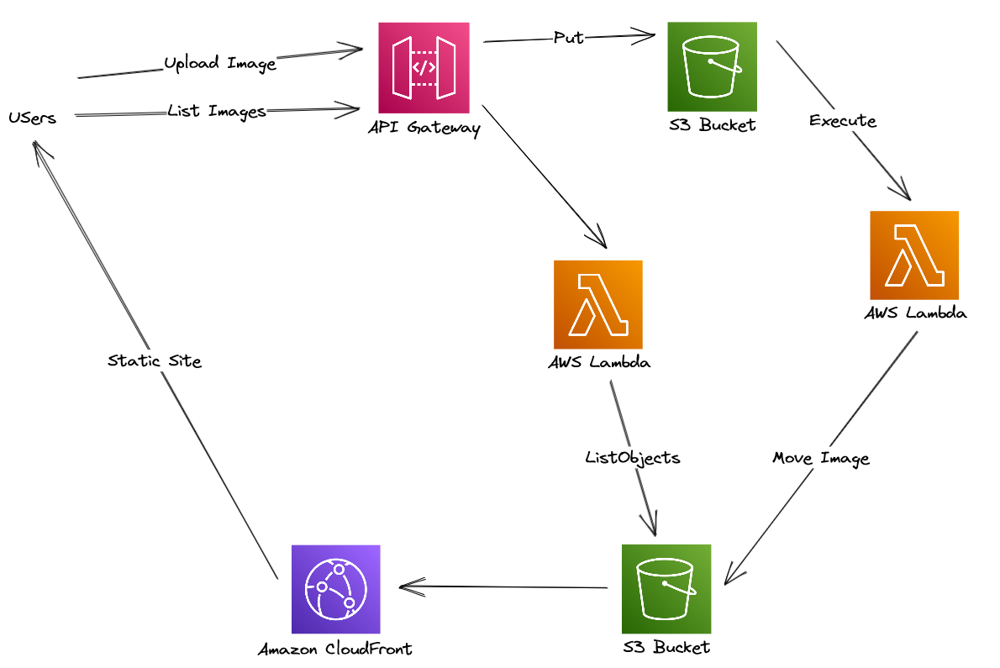

# AWS Serverless Simple Image Gallery

This repo contains an AWS Serverless application using CDK top define the Infrastructure, written in C#. This defines an application that will deploy a website, API and simple cataloguing code to allow images to be uploaded via an API and then shown in a simple website.

## Overview

## Flow
1. User uploads an image to the API via a POST
2. API Gateway directly PUT's this to S3
3. An S3 Event fires a Lambda
4. The Lambda moves the file to a dated folder in the Web Bucket
5. The user browses to a CloudFront hosted website that is backed by the Web Bucket
6. The website does an API request to the API to get the categories (dated folders)
7. API Gateway uses a Lambda to get this list
8. The user browses to a folder
9. The website does an API request to the API to get the images in that category
10. API Gateway uses a Lambda to get the image list
11. The website renders the list of images via the CloudFront CDN

## Deployment

The `cdk.json` file tells the CDK Toolkit how to execute your app.

It uses the [.NET Core CLI](https://docs.microsoft.com/dotnet/articles/core/) to compile and execute your project.

## Useful commands

* `dotnet build src` compile this app
* `cdk deploy`       deploy this stack to your default AWS account/region
* `cdk diff`         compare deployed stack with current state
* `cdk synth`        emits the synthesized CloudFormation template

## Test Upload Command
`curl --data-binary '@example-images/face.png' https://YOURGATEWAYID.execute-api.eu-west-1.amazonaws.com/prod/image/face.png`

## Test Website
To use the website then please update the gallery.js file to include the correct ID of your API Gateway.

**Beware!** For a production environment then the API would have authentication - do not leave this deployed as it can be abused and could cost you money if large files are uploaded. It is an example only.